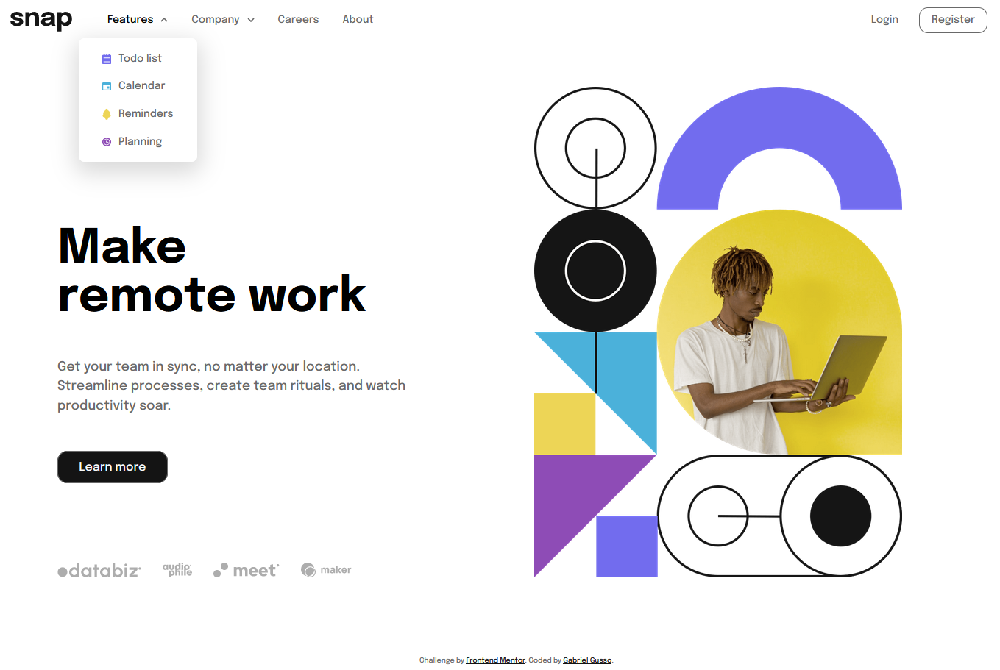
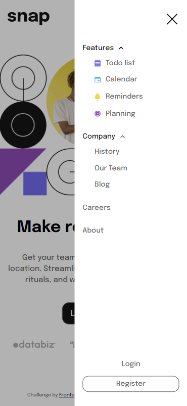

# Frontend Mentor | Intro Page With Dropdown Menu

Challenge do Frontend Mentor para a criação de uma homepage responsiva com menu dropdown.
 
 

# 📄 Sobre a aplicação

A proposta era simples: replicar o design da forma mais fiel possível e adicionar interatividade. Como a página não possuia muita complexidade, utilizei apenas _html, css e vanilla javascript_.

 
 

# **📷 Screenshots**

 
 

# 🌎 Acesso

A página está hospedada no GitHub Pages e pode ser acessada neste [link](https://g-pg.github.io/frontendmentor-intro-with-dropdown/).
